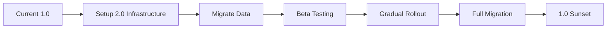

# 🚀 PressWire 2.0: Agentic Press Platform Blueprint
*Updated: September 18, 2025 | Pydantic AI v1.0.8*

## Executive Summary
Transform PressWire.ie into an **autonomous AI-powered press ecosystem** leveraging Pydantic AI's production-grade agent framework, creating Ireland's first truly agentic press release platform.

## 1. 🤖 Pydantic AI Agent Architecture (v1.0.8)

### Core Agent System:
```python
# Example architecture using Pydantic AI v1.0.8
from pydantic_ai import Agent, RunContext
from pydantic_ai.models import OpenAI, Anthropic

class PressWireAgents:
    # PR Creation Agent - Multi-model for best results
    writer = Agent(
        'claude-3.5-sonnet',  # Best for creative writing
        system_prompt="Expert PR writer for Irish businesses",
        result_type=PressRelease  # Structured output
    )

    # SEO Optimization Agent
    seo_optimizer = Agent(
        'gpt-4o-mini',  # Cost-effective for optimization
        system_prompt="SEO specialist for press releases",
        tools=[KeywordAnalyzer, CompetitorChecker]
    )

    # Compliance & Verification Agent
    compliance = Agent(
        'claude-3.5-haiku',  # Fast for validation
        system_prompt="Irish regulatory compliance expert",
        tools=[CROVerifier, GDPRChecker]
    )

    # Distribution Orchestrator
    distributor = Agent(
        'gpt-4o',
        system_prompt="Multi-channel distribution coordinator",
        tools=[GitHubPublisher, EmailSender, WebhookNotifier]
    )
```

### Agent Delegation & Workflow:
- **Level 1**: Single agent for simple tasks (generate headline)
- **Level 2**: Agent delegation (writer → SEO → compliance)
- **Level 3**: Multi-agent collaboration with shared context
- **Level 4**: Graph-based workflows for complex campaigns

### Key Pydantic AI Features We'll Use:
- **Type-safe outputs** with Pydantic models
- **Tool approval** for sensitive operations (publishing, payments)
- **Streaming structured outputs** for real-time preview
- **Logfire integration** for observability
- **Dependency injection** for testing
- **Result validators** for quality assurance

## 2. 🏗️ Infrastructure Stack (2025 Best Practices)

### Database Layer: **Supabase** (Perfect fit)
```javascript
// Real-time PR updates
const { data, error } = await supabase
  .from('press_releases')
  .insert([pr])
  .select()
  .single();

// Vector search for similar PRs
const { data: similar } = await supabase.rpc('match_prs', {
  query_embedding: embedding,
  match_threshold: 0.8,
  match_count: 5
});
```

### Netlify Extensions Integration:
1. **Supabase Integration** - Database & Auth
2. **Async Workloads** - Background AI processing
3. **Content Security Policy** - XSS protection
4. **Turso** - Edge database for analytics
5. **LaunchDarkly** - Feature flags for gradual rollout
6. **Lighthouse** - Performance monitoring
7. **Arcjet** - Rate limiting & DDoS protection

### Edge Functions for AI:
```javascript
// Netlify Edge Function for AI processing
export default async (request, context) => {
  const agent = new PressReleaseAgent();
  const result = await agent.run(request.body);
  return context.json(result);
};
```

## 3. 🎯 Agentic Features Roadmap

### Phase 1: Foundation (October 2025)
- Migrate to Supabase for data persistence
- Implement basic Pydantic AI agents
- Set up structured output validation
- Add user authentication system
- Create agent testing framework

### Phase 2: Intelligence Layer (November 2025)
- Multi-agent PR creation workflow
- Real-time collaborative editing
- AI-powered media matching
- Automated compliance checking
- Smart scheduling system

### Phase 3: Automation (December 2025)
- Scheduled PR campaigns
- Auto-optimization based on analytics
- Journalist outreach automation
- Multi-language translation
- Performance guarantees

### Phase 4: Advanced AI (Q1 2026)
- Voice-to-PR generation
- Image-to-story creation
- Predictive performance scoring
- Automated A/B testing
- Agent self-improvement

## 4. 💡 Innovative Features

### "AI Press Room" Concept:
```python
class PressRoom:
    """Virtual newsroom with specialized AI agents"""

    agents = {
        'editor': Agent(...),      # Reviews and refines
        'researcher': Agent(...),   # Fact-checking
        'designer': Agent(...),     # Visual content
        'distributor': Agent(...),  # Multi-channel posting
        'analyst': Agent(...)       # Performance tracking
    }

    async def publish_campaign(self, brief: str):
        # Agents collaborate to create full campaign
        draft = await self.agents['editor'].run(brief)
        facts = await self.agents['researcher'].verify(draft)
        visuals = await self.agents['designer'].create(draft)
        return await self.agents['distributor'].publish_all()
```

### Real-time Features:
- Live AI suggestions as you type
- Instant SEO scoring updates
- Real-time journalist interest indicator
- Live competitor analysis
- Collaborative agent workspace

### Unique Capabilities:
1. **PR From Anything**: URL, image, audio, video, or bullet points
2. **Predictive Analytics**: Know success probability before publishing
3. **Smart Scheduling**: AI picks optimal publish time per timezone
4. **Auto-Personalization**: Tailored versions for each journalist
5. **Performance Guarantee**: AI optimization until target metrics reached
6. **Story Evolution**: AI tracks and suggests follow-up stories
7. **Crisis Detection**: Early warning system for negative coverage

## 5. 📊 Technical Architecture

### API Design:
```typescript
// TypeScript API structure
interface PressWireAPI {
  // Agent endpoints
  '/api/agents/generate': AgentEndpoint<GenerateRequest, PressRelease>
  '/api/agents/optimize': AgentEndpoint<OptimizeRequest, OptimizedPR>
  '/api/agents/distribute': AgentEndpoint<DistributeRequest, DistributionResult>
  '/api/agents/analyze': AgentEndpoint<AnalyzeRequest, Analytics>

  // Real-time subscriptions
  '/api/realtime/pr/:id': RealtimeEndpoint<PRUpdates>
  '/api/realtime/analytics': RealtimeEndpoint<Analytics>
  '/api/realtime/agents': RealtimeEndpoint<AgentStatus>

  // Webhook endpoints
  '/api/webhooks/stripe': WebhookEndpoint<StripeEvent>
  '/api/webhooks/media': WebhookEndpoint<MediaCoverage>
}
```

### State Management:
```javascript
// Zustand for client state with Pydantic AI integration
const usePressStore = create((set) => ({
  draft: null,
  agents: {
    writer: { status: 'idle', result: null },
    seo: { status: 'idle', result: null },
    compliance: { status: 'idle', result: null }
  },
  runAgents: async (input) => {
    // Orchestrate agent pipeline
    set({ agents: { writer: { status: 'running' } } });
    const result = await fetch('/api/agents/generate', {
      method: 'POST',
      body: JSON.stringify(input)
    });
    set({ agents: { writer: { status: 'complete', result } } });
  }
}));
```

### Database Schema:
```sql
-- Supabase schema
CREATE TABLE organizations (
  id UUID PRIMARY KEY,
  name TEXT NOT NULL,
  cro_number TEXT UNIQUE,
  domain TEXT UNIQUE,
  subscription_tier TEXT,
  ai_credits INTEGER DEFAULT 0,
  created_at TIMESTAMP DEFAULT NOW()
);

CREATE TABLE press_releases (
  id UUID PRIMARY KEY,
  org_id UUID REFERENCES organizations(id),
  title TEXT NOT NULL,
  content JSONB NOT NULL,
  status TEXT DEFAULT 'draft',
  ai_agents_used JSONB,
  performance_metrics JSONB,
  vector_embedding vector(1536),
  published_at TIMESTAMP,
  created_at TIMESTAMP DEFAULT NOW()
);

CREATE TABLE agent_logs (
  id UUID PRIMARY KEY,
  pr_id UUID REFERENCES press_releases(id),
  agent_type TEXT NOT NULL,
  model_used TEXT,
  tokens_used INTEGER,
  cost_cents INTEGER,
  duration_ms INTEGER,
  result JSONB,
  created_at TIMESTAMP DEFAULT NOW()
);

-- Enable vector search
CREATE INDEX ON press_releases USING ivfflat (vector_embedding vector_cosine_ops);
```

## 6. 💰 Business Model Evolution

### Pricing Tiers (2025):
| Tier | Price/Month | Features | Target |
|------|------------|----------|--------|
| **Starter** | €99 | 5 AI PRs, Basic agents | Small businesses |
| **Growth** | €299 | 20 PRs, All agents, Analytics | Growing companies |
| **Professional** | €599 | 50 PRs, API access, Priority | PR agencies |
| **Agency** | €999 | Unlimited, White-label, Custom agents | Large agencies |
| **Enterprise** | Custom | Dedicated infrastructure, SLA | Corporations |

### Revenue Streams:
- **Subscriptions**: Recurring monthly revenue
- **Pay-per-PR**: €29 for occasional users
- **API Access**: Usage-based pricing for developers
- **White-label**: €5,000 setup + revenue share
- **AI Training**: Custom model training on company data
- **Journalist Network**: Premium distribution add-on
- **Analytics Pro**: Advanced insights package

### Unit Economics:
```
Per PR Cost Breakdown:
- AI processing: €0.10-0.50
- Storage: €0.01
- Bandwidth: €0.02
- Total: ~€0.53

Revenue per PR: €19.80 (at €99/5 PRs)
Margin: 97.3%
```

## 7. 🔒 Security & Compliance

### GDPR & AI Act Compliance:
```python
# Pydantic AI with compliance controls
compliance_agent = Agent(
    model='claude-3.5-haiku',
    system_prompt="""
    Ensure all content complies with:
    - GDPR regulations
    - EU AI Act requirements
    - Irish data protection laws
    - Industry-specific regulations
    """,
    result_validators=[
        validate_no_pii,
        validate_no_harmful_content,
        validate_factual_accuracy,
        validate_gdpr_compliance
    ],
    tools=[
        GDPRChecker(),
        PIIRedactor(),
        FactChecker(),
        RegulatoryValidator()
    ]
)
```

### Security Architecture:
- **Zero Trust**: Every request authenticated
- **Encryption**: AES-256 at rest, TLS 1.3 in transit
- **Secrets Management**: Netlify environment variables
- **Rate Limiting**: Arcjet protection per endpoint
- **Audit Logging**: Every action tracked
- **Data Residency**: EU-only infrastructure
- **Backup Strategy**: Daily snapshots, 30-day retention

### AI Safety:
- Human-in-the-loop for critical decisions
- Explainable AI outputs
- Bias detection and mitigation
- Hallucination prevention
- Content filtering

## 8. 🚀 Migration Strategy

### Current (1.0) → Future (2.0):


### Implementation Steps:
1. **Week 1-2**: Infrastructure setup
   - Create Supabase project
   - Configure Netlify extensions
   - Set up Pydantic AI environment

2. **Week 3-4**: Core development
   - Build agent system
   - Implement auth
   - Create admin dashboard

3. **Week 5-6**: Data migration
   - Export existing PRs
   - Import to Supabase
   - Verify data integrity

4. **Week 7-8**: Beta testing
   - Select 10 beta users
   - Gather feedback
   - Fix critical issues

5. **Week 9-10**: Launch
   - Public announcement
   - Marketing campaign
   - Monitor performance

### Backwards Compatibility:
- All v1 URLs redirect to v2
- API v1 continues for 6 months
- Existing customers grandfathered pricing
- No feature removal, only additions

## 9. 📈 Success Metrics & KPIs

### Technical KPIs:
| Metric | Target | Current |
|--------|--------|---------|
| AI response time | <2s | N/A |
| PR generation | <30s | 60s |
| System uptime | 99.9% | 99% |
| AI accuracy | >95% | N/A |
| Page load speed | <1s | 2s |
| API response time | <200ms | 500ms |

### Business KPIs:
| Metric | Target | Current |
|--------|--------|---------|
| User activation | 50% | 30% |
| Monthly retention | 80% | N/A |
| Revenue per user | €200 | €99 |
| AI cost per PR | <€0.50 | €0.20 |
| Customer satisfaction | >4.5/5 | N/A |
| Journalist engagement | 25% | 10% |

### AI Performance Metrics:
- Model accuracy: Track per agent
- Token efficiency: Optimize prompts
- Cost per operation: Monitor spending
- User satisfaction: Per AI interaction
- Error rates: Track failures

## 10. 🎨 Future Vision (2026+)

### Next-Gen Features:
1. **Autonomous PR Campaigns**: Self-running, self-optimizing
2. **Predictive News Cycles**: AI predicts trending topics
3. **Virtual Press Conferences**: AI avatars present
4. **Neural Style Transfer**: Adapt writing to any brand voice
5. **Quantum Analytics**: Advanced pattern recognition
6. **AR Press Kits**: Augmented reality presentations
7. **Blockchain Verification**: Immutable PR records

### Market Expansion:
- **UK Launch** (Q2 2026): presswire.co.uk
- **EU Expansion** (Q3 2026): presswire.eu
- **US Market** (Q4 2026): presswire.ai
- **APAC Entry** (2027): presswire.asia

### Technology Roadmap:
- **2026 Q1**: Multi-modal AI (video, audio)
- **2026 Q2**: Real-time translation (50+ languages)
- **2026 Q3**: AI journalist matching
- **2026 Q4**: Predictive analytics v2
- **2027**: Fully autonomous operations

## 11. 🛠️ Development Resources

### Required Skills:
- **Backend**: Python (Pydantic AI), Node.js
- **Frontend**: React/Next.js, TypeScript
- **AI/ML**: LLM integration, prompt engineering
- **Database**: PostgreSQL, vector databases
- **DevOps**: Netlify, GitHub Actions
- **Security**: OWASP, penetration testing

### Team Structure:
- **Lead Developer**: Full-stack + AI
- **AI Engineer**: Pydantic AI specialist
- **Frontend Developer**: React + real-time
- **DevOps Engineer**: Infrastructure + monitoring
- **QA Engineer**: Testing + evaluation

### Development Tools:
```yaml
# Development stack
languages:
  - Python 3.11+ (Pydantic AI)
  - TypeScript 5.0+
  - SQL (Supabase)

frameworks:
  - Pydantic AI v1.0.8
  - Next.js 14
  - Tailwind CSS
  - Zustand (state)

infrastructure:
  - Netlify (hosting + functions)
  - Supabase (database + auth)
  - GitHub (version control)
  - Stripe (payments)

monitoring:
  - Pydantic Logfire
  - Netlify Analytics
  - Sentry (errors)
  - PostHog (product analytics)
```

## 12. 📚 Documentation & Training

### Documentation Needed:
1. **API Documentation**: OpenAPI spec
2. **Agent Documentation**: Each agent's capabilities
3. **User Guide**: How to use the platform
4. **Developer Guide**: API integration
5. **Admin Guide**: Platform management

### Training Materials:
- Video tutorials for each feature
- Agent prompt templates
- Best practices guide
- Case studies
- Webinar series

## 13. 🎯 Risk Mitigation

### Technical Risks:
| Risk | Impact | Mitigation |
|------|--------|------------|
| AI hallucination | High | Multiple validators |
| API rate limits | Medium | Caching + queuing |
| Data loss | High | Daily backups |
| Security breach | Critical | Penetration testing |
| Downtime | High | Multi-region deployment |

### Business Risks:
| Risk | Impact | Mitigation |
|------|--------|------------|
| Competitor copying | Medium | Fast innovation |
| AI cost increase | High | Multi-model strategy |
| Regulatory changes | Medium | Compliance buffer |
| Market saturation | Low | Niche focus |

## 14. 🏁 Implementation Checklist

### Immediate Actions (This Week):
- [ ] Complete 1.0 setup and testing
- [ ] Document current architecture
- [ ] Create Supabase account
- [ ] Install Pydantic AI locally
- [ ] Set up development environment

### Short Term (October 2025):
- [ ] Build prototype agent
- [ ] Design database schema
- [ ] Create authentication flow
- [ ] Implement basic UI
- [ ] Set up monitoring

### Medium Term (November 2025):
- [ ] Complete agent suite
- [ ] Launch beta program
- [ ] Implement analytics
- [ ] Add payment tiers
- [ ] Create documentation

### Long Term (December 2025):
- [ ] Public launch
- [ ] Marketing campaign
- [ ] Scale infrastructure
- [ ] Hire support team
- [ ] Plan international expansion

## Conclusion

PressWire 2.0 represents a paradigm shift from a static PR tool to an intelligent, autonomous press ecosystem. By leveraging Pydantic AI v1.0.8's production-grade framework with Netlify's modern infrastructure, we're not just building another PR platform – we're creating the future of press communications.

The agentic approach transforms every aspect of the PR workflow, from initial ideation to performance optimization. With specialized AI agents handling complex tasks, businesses can focus on their story while our platform ensures maximum impact and reach.

This isn't just an upgrade – it's a complete reimagination of what a press release platform can be in 2025 and beyond.

---

*"From press release to press ecosystem – powered by AI, driven by results."*

**Next Step**: Complete current 1.0 setup, then begin Phase 1 of 2.0 development in October 2025.